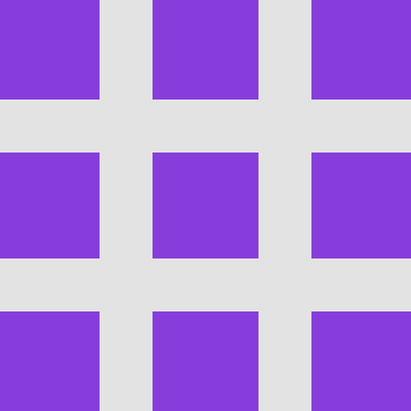

# Revolution - A Rotational Puzzle Game for Android



Revolution is an engaging and challenging puzzle game for Android where the goal is to sort a grid of numbers into ascending order. The catch? You can only make moves by rotating 2x2 subgrids. With adjustable grid sizes and difficulty, Revolution offers a fun brain-teaser for puzzle enthusiasts of all levels.

This project was developed by Ethan Wight as an Android application using Java and the Material Design component library.

## How to Play

The objective is simple: arrange the numbers on the grid in ascending order, starting from 1 in the top-left corner and increasing from left to right, top to bottom.

1.  **Start a New Game**: Upon launching the app, you can select the desired grid size and "solution depth" (difficulty) and press "New Game" to begin.
2.  **Select a Subgrid**: To make a move, you must first select a 2x2 subgrid to rotate. Tap on the tile that you want to be the **top-left corner** of the 2x2 block. The selected subgrid will be highlighted.
3.  **Rotate the Subgrid**: Once a subgrid is highlighted, use the **"Rotate Left"** (counter-clockwise) or **"Rotate Right"** (clockwise) buttons to perform the rotation.
4.  **Keep Rotating**: Continue selecting and rotating subgrids until all the numbers are in their correct sequential order.
5.  **You Win!**: When the puzzle is solved, the board will flash with colors, and a congratulatory message will appear.

If you make a mistake, don't worry! You can always use the **"Undo"** button to revert your last move.

## Features

-   **Multiple Grid Sizes**: Challenge yourself with different board dimensions. The game supports:
    -   3x3
    -   3x4
    -   4x4
-   **Adjustable Difficulty**: You can set the "Solution Depth" before starting a new game. This determines how many random rotations are made to scramble the puzzle, ranging from 1 (easier) to 20 (harder).
-   **Intuitive UI**: A clean and straightforward interface built with Material Design components makes playing the game easy and enjoyable. The app supports both portrait and landscape orientations.
-   **Undo Functionality**: Made a wrong move? The "Undo" button allows you to step back through your move history.
-   **Sound Effects**: The game includes sound effects for rotations and a special sound to celebrate when you solve the puzzle.
-   **State Preservation**: Your game's progress is automatically saved if you rotate your device or leave the app, so you can pick up right where you left off.
-   **Splash Screen**: The app features a modern splash screen on launch, built using the Android Core Splashscreen API.

## Building from Source

To build and run this project yourself, you will need:

-   Android Studio
-   An Android device or emulator

Follow these steps:

1.  **Clone the repository:**
    ```bash
    git clone [https://github.com/ethanwight/revolution.git](https://github.com/ethanwight/revolution.git)
    ```
2.  **Open in Android Studio:**
    -   Launch Android Studio.
    -   Select "Open an existing project".
    -   Navigate to the cloned repository folder and open it.
3.  **Build the project:**
    -   Android Studio will automatically sync the Gradle project.
    -   Once the sync is complete, you can build the project by going to `Build > Make Project`.
4.  **Run the app:**
    -   Select a run configuration (usually the `app` module).
    -   Choose an available Android device or emulator.
    -   Click the "Run" button to install and launch the application.

The project is configured using Gradle with the Kotlin DSL and uses a version catalog (`libs.versions.toml`) for dependency management.

---

*Developed by Ethan Wight*
